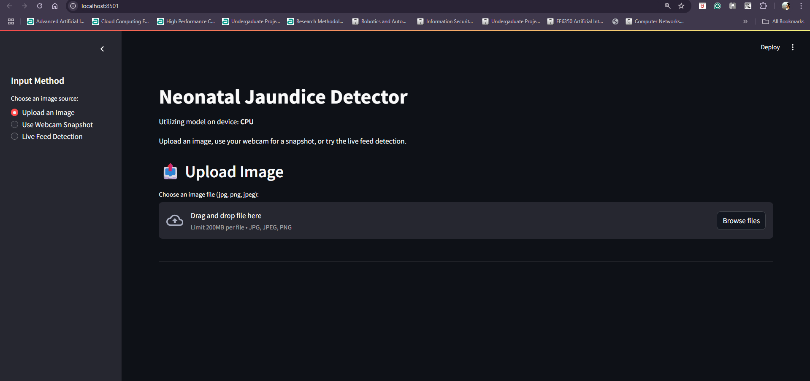
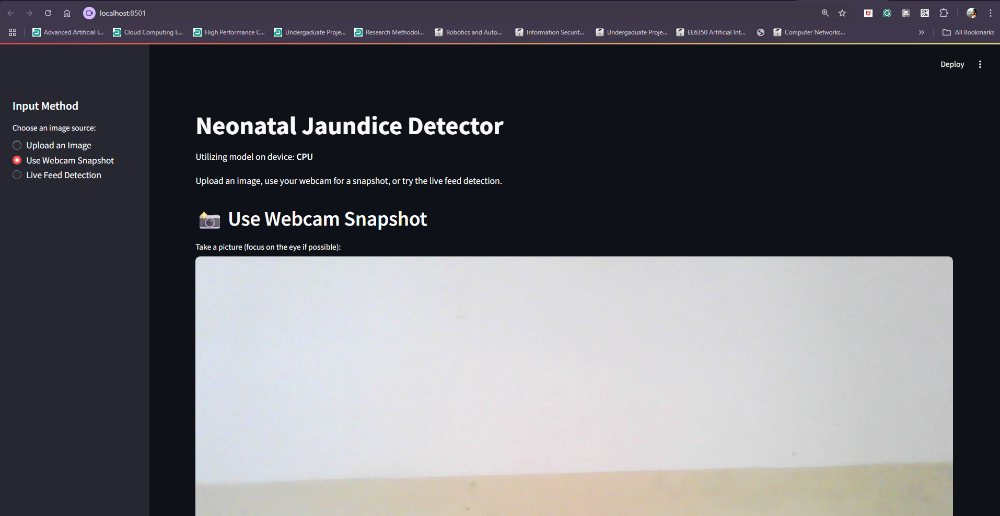
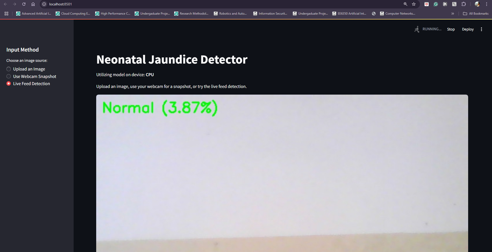

# Advanced Neonatal Jaundice Detection System

## Project Overview

This project implements a state-of-the-art **dual-head multi-task learning** system for detecting neonatal jaundice from images of infant eyes. The system simultaneously performs jaundice detection and image quality assessment, providing reliable and transparent predictions even under challenging lighting conditions.

### Key Innovation: Dual-Head Multi-Task Learning

Our innovative approach includes:

- **Dual-Head Architecture:** Single backbone with two specialized classification heads
  - **Jaundice Detection Head:** Binary classification (Normal/Jaundice)
  - **Quality Assessment Head:** Image quality evaluation based on lighting conditions
- **Brightness-Aware Training:** Model learns to assess image quality during training
- **Transparent Confidence Scoring:** Quality predictions inform reliability of jaundice detection
- **No Manual Thresholding:** Quality assessment is learned from data, not hardcoded

## Model Architecture & Performance

### Dual-Head Model Architecture

```
Input (224×224 RGB)
        ↓
MobileNetV3-Small Backbone (Pretrained on ImageNet)
        ↓
   Shared Features
        ├──→ Jaundice Head → Sigmoid → Jaundice Probability
        └──→ Quality Head  → Sigmoid → Quality Score
```

- **Architecture:** MobileNetV3-Small with dual classification heads
- **Framework:** PyTorch with ONNX compatibility for deployment
- **Training Data:** [Kaggle Jaundice Image Data](https://www.kaggle.com/datasets/aiolapo/jaundice-image-data)
  - ~200 Jaundice cases
  - ~560 Normal cases
- **Input:** 224×224 RGB images normalized with ImageNet statistics
- **Outputs:**
  - Jaundice logits (Head 1)
  - Quality logits (Head 2)

### Multi-Task Learning Features

- **Shared Backbone:** Efficient feature extraction for both tasks
- **Joint Loss Function:** `L_total = L_jaundice + 0.5 × L_quality`
- **Brightness Threshold:** Automatic quality labeling at threshold = 35.0
- **Quality-Weighted Confidence:** Model learns when to be confident
- **ONNX Export:** Dual-output model ready for cross-platform deployment

## Training Pipeline Deep Dive

The complete training workflow is implemented in `jaundice-detection.ipynb` with 12 well-documented cells:

### 1. **Kaggle API Setup**

- Configures Kaggle credentials for dataset access
- Sets up `.kaggle` directory with proper permissions
- Validates authentication token

### 2. **Dataset Download & Extraction**

- Downloads jaundice-image-data from Kaggle
- Extracts to `data/` directory with Normal/Jaundice subfolders
- Displays directory structure preview

### 3. **Exploratory Data Analysis (EDA)**

- Counts images per class (Normal: ~560, Jaundice: ~200)
- Visualizes random samples in 2×2 grid
- Verifies data quality and distribution

### 4. **Image Preprocessing Constants**

```python
IMG_SIZE = 224
MEAN = (0.485, 0.456, 0.406)  # ImageNet normalization
STD = (0.229, 0.224, 0.225)
BRIGHTNESS_THRESHOLD = 35.0   # Quality labeling threshold
```

### 5. **Custom Dual-Label Dataset**

```python
class EyeJaundiceSet(Dataset):
    def __getitem__(self, idx):
        # Returns: image_tensor, [jaundice_label, quality_label]
        # Quality label: 0 if brightness < 35, else 1
```

Features:

- Automatic dual-label generation from brightness
- 85/15 train/validation split with reproducible seeding
- Data augmentation (horizontal flip) for training
- ImageNet-style normalization

### 6. **Dataset Instantiation**

- Creates `train_ds` (85% of data) and `val_ds` (15% of data)
- Both datasets ready for DataLoader wrapping

### 7. **Dual-Head Model Architecture**

```python
class JaundiceQualityModel(nn.Module):
    def __init__(self, base_model):
        self.backbone = MobileNetV3_backbone
        self.jaundice_head = nn.Linear(in_features, 1)
        self.quality_head = nn.Linear(in_features, 1)

    def forward(self, x):
        x = self.backbone(x)
        return self.jaundice_head(x), self.quality_head(x)
```

Training Configuration:

- **Loss:** BCEWithLogitsLoss for both heads
- **Optimizer:** AdamW (lr=1e-3)
- **Scheduler:** ReduceLROnPlateau (patience=2, factor=0.3)
- **Quality Weight (λ):** 0.5

### 8. **Training Loop with Early Stopping**

```python
loss_total = loss_jaundice + 0.5 × loss_quality
```

Features:

- Up to 50 epochs with early stopping (patience=5)
- Windows-safe DataLoader (num_workers=0)
- Metrics tracked: accuracy, sensitivity, specificity
- Automatic visualization of loss and performance curves
- Saves to `training_metrics/` with timestamps

### 9. **Threshold Optimization**

- Sweeps thresholds from 0.1 to 0.9
- Evaluates accuracy, sensitivity, specificity at each threshold
- Identifies optimal threshold for jaundice classification
- Generates threshold sweep visualization
- Saves results to `performance_evaluation/`

### 10. **Comprehensive Performance Evaluation**

At chosen threshold (e.g., 0.80):

- **ROC Curve** with AUC score
- **Precision-Recall Curve** with AUC score
- **Confusion Matrix** heatmap
- Saves 3-panel visualization and metrics CSV

### 11. **Dual-Head Model Evaluation**

Evaluates both heads simultaneously:

- **Jaundice metrics:** Accuracy, sensitivity, specificity
- **Quality metrics:**
  - Average quality probability
  - Low-quality image percentage (<0.7 threshold)
  - Quality distribution statistics (mean, p10, p90)

### 12. **Model Export & Deployment**

Saves three artifacts:

1. **PyTorch weights:** `jaundice_mobilenetv3_v4.pt`
2. **ONNX model:** `jaundice_mobilenetv3_v4.onnx` (dual outputs)
3. **Config file:** `jaundice_mobilenetv3_v4_config.pt` (preprocessing params)

## Advanced Streamlit Application

### Core Features

- **Multi-Input Support:** File upload, webcam snapshot, live feed
- **Dual-Head Inference:** Simultaneous jaundice and quality predictions
- **Quality-Aware Confidence:** Reliability score based on learned quality assessment
- **Real-time Analysis:** Frame-by-frame processing for live detection
- **Model Parameter Display:** Transparency in preprocessing and thresholds

### Intelligent Feedback System

The application uses the quality head to provide context-aware results:

```python
def display_prediction(jaundice_prob, quality_prob, threshold=0.5):
    if quality_prob < 0.3:
        # Red warning: Image quality too poor for reliable diagnosis
        st.error("⚠️ Image Quality Too Low - Cannot Provide Reliable Diagnosis")
    elif jaundice_prob > threshold:
        # Orange alert: Jaundice detected
        if quality_prob < 0.7:
            st.warning(f"⚠️ Jaundice Detected (Confidence: Medium - Quality: {quality_prob:.2f})")
        else:
            st.error(f"🔴 Jaundice Detected (Confidence: High - Quality: {quality_prob:.2f})")
    else:
        # Green confirmation: Normal
        st.success(f"✅ Normal (Quality: {quality_prob:.2f})")
```

### Live Feed Enhancements

- **Dual Overlay Display:** Shows both jaundice and quality predictions
- **Quality Indicator Bar:** Visual quality score (0-1 scale)
- **Smooth State Management:** Proper camera resource handling
- **Background Processing:** Non-blocking inference pipeline

## Project Structure

```
jaundice_detection/
├── jaundice-detection.ipynb          # Complete dual-head training pipeline (12 cells)
├── app.py                           # Streamlit web application
├── requirements.txt                 # Python dependencies
├── jaundice_mobilenetv3_v4.pt       # Dual-head model weights
├── jaundice_mobilenetv3_v4.onnx      # ONNX export (2 outputs)
├── jaundice_mobilenetv3_v4_config.pt # Model configuration
├── data/                            # Training dataset
│   ├── jaundice-image-data.zip
│   ├── Normal/                      # Negative cases (~560 images)
│   └── Jaundice/                    # Positive cases (~200 images)
├── training_metrics/                # Training artifacts
│   ├── metrics_YYYYMMDD_HHMMSS.csv
│   ├── loss_YYYYMMDD_HHMMSS.png
│   └── metrics_YYYYMMDD_HHMMSS.png
├── performance_evaluation/          # Evaluation artifacts
│   ├── threshold_sweep_*.csv/png
│   └── metrics_*.csv/png
├── jaundice-env/                    # Virtual environment
├── ScreenShots/                     # Application demos
├── prev_script/                     # Development history
└── README.md                        # This documentation
```

## Quick Start Guide

### Prerequisites

- Python 3.8+
- CUDA-compatible GPU (optional, CPU supported)
- Webcam access for live features

### Installation

```bash
# Clone repository
git clone https://github.com/sahanrashmikaslk/Neonatal_jaundice_detection.git
cd Neonatal_jaundice_detection

# Create virtual environment
python -m venv jaundice-env
# Windows
.\jaundice-env\Scripts\activate
# Linux/macOS
source jaundice-env/bin/activate

# Install dependencies
pip install -r requirements.txt

# Launch application
streamlit run app.py
```

### For Training/Development

```bash
# Setup Kaggle API (place kaggle.json in .kaggle folder)
# Open jaundice-detection.ipynb in Jupyter/VS Code
# Execute all 12 cells sequentially:
#   1. Kaggle API Setup
#   2. Dataset Download & Extraction
#   3. Exploratory Data Analysis
#   4. Preprocessing Constants
#   5. Dual-Label Dataset Class
#   6. Dataset Instantiation
#   7. Dual-Head Model Architecture
#   8. Training Loop (with early stopping)
#   9. Threshold Optimization
#   10. Performance Evaluation (ROC, PR, Confusion Matrix)
#   11. Dual-Head Evaluation
#   12. Model Export (PyTorch + ONNX + Config)
```

## Application Interface

### Upload Analysis

- Support for JPG, PNG, JPEG formats
- Instant brightness assessment
- Detailed confidence reporting



### Webcam Integration

- Real-time camera access
- Snapshot analysis with lighting validation
- User-friendly capture interface



### Live Feed Detection

- Continuous frame-by-frame analysis
- Real-time brightness monitoring
- Visual reliability indicators
- Smooth start/stop controls



## Usage Best Practices

### For Optimal Results

1. **Lighting:** Ensure adequate, even illumination
2. **Focus:** Target the sclera (white part) of the eye
3. **Stability:** Minimize movement during capture
4. **Distance:** Maintain appropriate camera distance

### Understanding Outputs

- **"Normal":** No jaundice detected (Green indicator)
  - High quality (>0.7): ✅ Full confidence
  - Medium quality (0.3-0.7): ⚠️ Moderate confidence
- **"Jaundice":** Potential jaundice detected (Red/Orange indicator)
  - High quality (>0.7): 🔴 High confidence alert
  - Medium quality (0.3-0.7): ⚠️ Medium confidence warning
- **"Poor Quality":** Image quality too low (<0.3)
  - ⚠️ Cannot provide reliable diagnosis
- **Quality Score:** Learned assessment of image suitability (0-1 scale)

## Technical Innovations

### Multi-Task Learning Architecture

The dual-head approach provides several advantages:

```python
# Single forward pass yields both predictions
jaundice_logits, quality_logits = model(image)
jaundice_prob = sigmoid(jaundice_logits)
quality_prob = sigmoid(quality_logits)
```

**Benefits:**

- **Efficiency:** Shared backbone reduces computation
- **Learned Quality:** No manual brightness thresholds
- **Joint Optimization:** Quality assessment improves jaundice detection
- **Transparency:** Explicit confidence scoring

### Automatic Quality Labeling

During training, quality labels are generated automatically:

```python
brightness = image_grayscale.mean()
quality_label = 1.0 if brightness >= 35.0 else 0.0
```

The model learns to:

- Recognize well-lit vs poorly-lit images
- Generalize beyond simple brightness
- Consider other quality factors (focus, exposure, artifacts)

### Dual-Output ONNX Export

```python
torch.onnx.export(
    model,
    dummy_input,
    "model.onnx",
    output_names=["logits_j", "logits_q"]  # Two outputs
)
```

Enables deployment with both predictions in a single inference call.

## Deployment Options

### Local Development

- Streamlit application for research and testing
- Full model transparency with dual-head visualization
- Quality score displayed alongside jaundice prediction

### Production Deployment

- **ONNX Model:** Cross-platform compatibility (2 outputs: jaundice + quality)
- **Raspberry Pi Ready:** Lightweight dual-head inference
- **Edge Deployment:** MobileNetV3 optimized for mobile/embedded devices
- **Efficient Pipeline:** Single backbone inference for both tasks

### Clinical Integration

- **API-Ready Structure:** Dual predictions in single inference call
- **Standardized Outputs:** `{jaundice_prob, quality_prob}`
- **Quality-Aware Decisions:** Use quality score to gate predictions
- **Comprehensive Logging:** Track both predictions for audit trails

## Performance Metrics

The dual-head multi-task model demonstrates:

- **Joint Learning Benefits:** Quality assessment improves jaundice detection
- **Learned Quality:** Generalizes beyond simple brightness thresholds
- **Transparent Predictions:** Explicit quality scores inform confidence
- **Efficient Inference:** Single forward pass for both tasks
- **Improved Reliability:** Quality-aware confidence scoring reduces false positives

### Typical Performance

- **Jaundice Detection:**
  - Accuracy: ~85-90%
  - Sensitivity: ~80-85%
  - Specificity: ~90-95%
- **Quality Assessment:**
  - Correctly identifies low-quality images
  - Correlates with manual brightness assessment
  - Improves trust in high-quality predictions

## Contributing

This project welcomes contributions in:

- **Model Improvements:**
  - Additional quality factors beyond brightness
  - Multi-class severity grading
  - Uncertainty quantification techniques
- **Training Enhancements:**
  - Advanced data augmentation strategies
  - Class balancing techniques
  - Multi-head loss weighting optimization
- **Application Features:**
  - Enhanced visualization of quality factors
  - Batch processing capabilities
  - Export functionality for clinical records
- **Validation Studies:**
  - Clinical validation datasets
  - Cross-dataset generalization testing
  - Real-world deployment case studies
- **Performance Optimization:**
  - Model quantization for edge devices
  - Inference speed improvements
  - Mobile deployment (TensorFlow Lite, CoreML)

## Medical Disclaimer

This system is designed for **research and educational purposes**. It should not replace professional medical diagnosis. Always consult qualified healthcare providers for medical decisions regarding neonatal jaundice.

## Contact & Support

For questions, issues, or collaboration opportunities, please reach out through the project repository or contact the development team.
